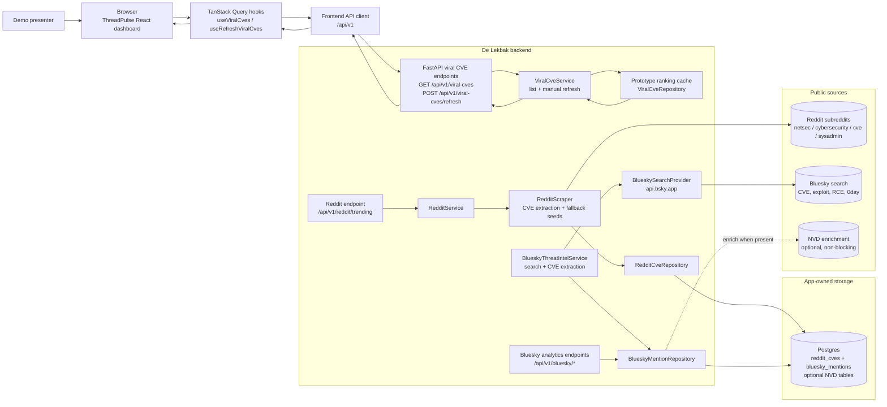

# De Lekbak prototype architecture flow

Use this Mermaid diagram in the prototype demo to explain how De Lekbak turns public CVE chatter into the ThreadPulse dashboard.

## Demo narration

- The browser shows **ThreadPulse**, the React/Vite frontend for De Lekbak.
- TanStack Query loads `/api/v1/viral-cves` and updates the page after a manual refresh.
- FastAPI owns the prototype API boundary; CORS is configured for the local Vite dev server.
- The current dashboard flow uses `ViralCveService` and a prototype in-memory ranking repository.
- Source-ingestion building blocks already live in the backend:
  - Reddit scraping extracts CVE IDs from selected cybersecurity subreddits and persists aggregates in Postgres.
  - Bluesky ingestion searches public posts, extracts CVE IDs, computes engagement, and persists mentions in Postgres.
  - Bluesky analytics can read trending CVEs, top posts, post counts, active authors, and optional NVD enrichment.
- NVD enrichment is optional: viral CVE discovery and display are designed to work even when enrichment is missing.

## Prototype boundaries to call out

- `de_lekbak/` is standalone and does not depend on `cve-intelligence` at runtime.
- Manual refresh is intentional for the hackathon demo; background scheduling is deferred.
- The visible dashboard currently reads the `/viral-cves` ranking endpoint; the Reddit and Bluesky data paths are available as backend prototype capabilities to connect into the ranking service next.
